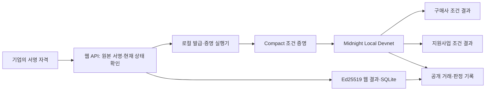

# BizProof — 기업 자격 한 번, 두 기관의 조건 검증

한 번 발급한 기업 자격을 구매사 등록과 지원사업 신청에 재사용하는 Midnight Korea Hackathon 2026 프로젝트입니다. 기업은 신청 대상을 선택하고 공유 내용에 동의하면 됩니다.

- **공개 체험:** https://bizproof.xaikorea.ai.kr/welcome
- **실제 Midnight 검증 증거:** https://bizproof.xaikorea.ai.kr/verification
- **이용자 가이드:** https://bizproof.xaikorea.ai.kr/guide
- **시연 영상·캡처·아키텍처·자막:** [2026-09-25 제출 자료](https://github.com/xaikorea/midnight-korea-hackathon-2026/releases/tag/hackathon-demo-2026-09-25)
- **심사자 실행 안내:** [docs/hackathon-runbook.md](docs/hackathon-runbook.md)
- **정보 공개 범위:** [docs/privacy-architecture.md](docs/privacy-architecture.md)

## 무엇을 해결하나요?

기업은 구매사 등록과 지원사업 신청 때 비슷한 서류를 반복 제출합니다. BizProof는 발급된 기업 자격을 재사용해 기관마다 필요한 조건을 확인합니다. 가상 한빛테크 자격 하나로 구매사의 매출 하한, 지원사업의 매출 상한·업력·지역 조건을 각각 검증합니다.

공개 체험: **대상 선택 → 공유 내용 확인·동의 → 한 번 제출**. 보유 자격 연결, 요청·nonce 생성, 정책 검사와 결과 저장은 자동으로 처리합니다.

신청 화면과 처리 과정 관제의 **블록체인 흐름 보기**에서 기업 자격 → Compact 증명 → 지갑 거래 준비 → 노드 전송 → 블록 확정을 시각화합니다. 구매사·지원사업·미충족·취소 구간을 선택하고 기록을 재생하거나 수동으로 이동할 수 있습니다. 단계를 누르면 문서 스캔·증명 생성·수수료 자원·거래 전송·블록 연결을 서로 다른 애니메이션으로 설명합니다. 취소 후 차단 장면도 별도로 표시합니다. 단계 설명 재생은 실행 위치를 바꾸지 않으며 일시정지·동작 줄이기를 지원합니다. 단계별 기술 설명, 공개 범위, 해당 시점까지 확정된 영수증을 확인합니다. 현재 신청의 서버 처리와 별도 Local Devnet 기록을 명시적으로 구분하며, 기록 재생은 거래를 생성하지 않습니다.

## 구현 범위와 실제 실행

| 경로 | 구현·검증 범위 |
|---|---|
| 공개 웹 신청 | 실제 Ed25519 자격 검사, 조건 판정, 기관별 요청·결과, SQLite 저장과 재조회. 서버가 원본 속성을 처리합니다. |
| Compact 계약 | 비공개 기업 속성 조건 판정, Schnorr 서명·보유자 연결, 발급자 신뢰·취소, 요청 기한·중복 방지. 9개 회로를 컴파일합니다. |
| Local Devnet 실행 | 공식 Midnight SDK·Wallet SDK·proof server·node·indexer로 배포, 구매사·지원사업·미충족 판정과 취소 후 차단을 실행합니다. |
| 웹 자격 연결 실행기 | 실제 웹의 서명 자격과 원래 요청을 검증한 뒤 같은 속성·정책으로 체인 증명을 생성하고 웹 결과를 대조합니다. |
| 검증 증거 화면 | 별도 합성 시연의 거래 영수증, 계약·요청 식별값, proof 처리 기록, 데이터 공개 범위를 표시합니다. |

**각 방문자의 일반 웹 신청이 자동으로 온체인 거래가 되는 것은 아닙니다.** 웹 결과와 Local Devnet 결과는 별도 검증 경로입니다. 기록 파일은 해당 실행 당시의 증거이며 Local Devnet의 현재 가동 상태를 뜻하지 않습니다. 실제 고객 정보, 공식 기업 인증, 지원금 선정·구매 계약 승인을 주장하지 않습니다.

2026-09-24 실제 웹 연결 실행에서 **11개 거래 확정, 동일 자격의 구매사·지원사업 충족, 비교 조건 미충족, 취소 후 재사용 차단**을 확인했습니다. [공개 실행 기록](public/evidence/midnight-web-devnet.json)과 [독립 인덱서 대조 결과](public/evidence/independent-verification.json)를 함께 제공합니다. 별도 읽기 전용 검증기로 모든 영수증·계약 검증 키·세 요청 결과·취소 상태를 다시 조회했습니다. 새 환경에서의 실행 방법은 위 심사자 안내를 따르세요.

제출 문구와 아직 확인해야 할 외부 항목은 [제출 준비 기록](docs/submission-notes.md)에 정리했습니다.

## 빠른 실행

웹은 Node.js **24.11.1** 이상과 npm **11.19.0** 기준입니다.

```sh
npx --yes npm@11.19.0 ci
npm run demo:local
```

`http://127.0.0.1:3100`에서 합성 체험을 시작합니다. 세션 비밀과 로컬 DB는 Git에서 제외된 `outputs/local-web-demo`에 저장됩니다. Sites 또는 외부 인증 계정은 필요하지 않습니다.

웹 검증·프로덕션 빌드:

```sh
npm run typecheck
npm run check:validators
npm run test:unit
npm run build:nhn
```

실제 Midnight 실행은 Linux / WSL2의 Docker Compose 환경을 사용합니다.

```sh
# 생성 자산이 없는 환경에서 설치·공식 컴파일러 확인·9개 회로 컴파일·회귀 검증
 docker compose -p bizproof-devnet -f contracts/standalone.yml build runner
# 로컬 서비스 시작
 docker compose -p bizproof-devnet -f contracts/standalone.yml up -d node proof-server indexer
# 동일 자격 재사용·미충족·취소 시나리오
 docker compose -p bizproof-devnet -f contracts/standalone.yml run --rm --no-deps runner
```

실제 웹의 자격과 요청을 연결하는 명령, 출력 파일, 실행 조건은 [실행 안내](docs/hackathon-runbook.md)를 참고하세요. 모든 로컬 개발 서비스는 loopback에 바인딩합니다. 시연은 공개 genesis 지갑의 로컬 자원만 사용합니다.

## 기술 구조

- 프런트엔드: React / TypeScript / Next.js, 한국어 PC·모바일 UI
- 공개 배포: NHN Compute, Docker Compose, Caddy HTTPS
- 업무 백엔드: Next.js API, SQLite WAL, 파일 저장소
- 자격·정책: Ed25519, 버전 고정 정책·nonce·동의·취소·만료 검사
- Midnight: Compact 0.31.1, runtime 0.16.0, Midnight.js 4.1.1, Wallet SDK 1.2.0, ledger-v8 8.1.0
- WASM 호환성: onchain-runtime-v3 3.0.0으로 통일. lockfile 및 override를 유지합니다.
- Cloudflare/Vinext 코드도 남아 있지만 현재 공개 서비스와 위 실행 절차는 NHN/Next.js 기준입니다.



현재 웹 서버와 로컬 발급·증명 실행기는 원본 속성을 처리합니다. 기관에는 필요한 조건 결과를 보여주며, 공개 식별값은 연결 가능하고 조건 결과에서 일부 범위를 추론할 수 있습니다. 원본 서류의 사실성은 발급기관의 검토에 의존합니다. 자세한 신뢰 경계는 [아키텍처 문서](docs/privacy-architecture.md)에 정리했습니다.

## 직접 구현한 부분과 오픈소스

- 기업 속성을 두 기관 정책에 재사용하는 Compact 회로와 요청·보유자·취소 연결
- 원래 웹 자격·요청과 체인 실행을 연결하는 검증·실행 흐름
- 동의·정책 스냅샷·중복·만료·예외 처리 및 간편 신청
- 실제 처리 기록과 독립된 Midnight 실행 증거 화면

Schnorr 모듈과 지갑 초기화 패턴은 Midnight example-zkloan에서 참고·재사용했습니다. [고지와 라이선스](THIRD_PARTY_NOTICES.md)를 확인하세요. SAP/GLEIF/Truvity는 업무 흐름 참고이며 해당 기관의 인증이나 서비스 연결을 의미하지 않습니다. 선택적 walt.id, Keycloak, OpenBao, OPA, OpenFGA, ClamAV, KERI/vLEI 어댑터는 별도 서비스 구성이 필요하고 기본 시연의 필수 의존성이 아닙니다.

## 검증과 한계

`Core verification` CI는 웹 빌드·핵심 테스트를, `Compact verification`은 새 환경의 회로 컴파일·SDK 검사를 실행합니다. 후자의 수동 실행에서 실제 Devnet 거래 검사도 선택할 수 있습니다.

[실제 Devnet CI 실행](https://github.com/xaikorea/midnight-korea-hackathon-2026/actions/runs/36019675856)은 새 GitHub 환경에서 컴파일·23개 검사·배포·조건 판정·취소 후 차단까지 통과했습니다. 이 독립 실행의 13개 영수증은 웹 연결 시연의 11개 기록과 별도 사례입니다.

공개 영상은 5분 15초, 1080p이며 11개 기능 구간에 한국어 자막과 직접 합성한 음악을 포함합니다. 실제 웹 신청·저장·재조회와 별도 Midnight 실행 기록을 구분합니다. 릴리스 ZIP에는 주요 캡처 12개, 아키텍처, SRT 자막, 공개 증거, 음악 출처와 녹화·편집 스크립트가 있습니다.

- 실제 고객 도입 수요·업무 시간 절감률은 아직 측정하지 않았습니다. [고객 검증 기록 양식](docs/customer-validation.md)
- 실제 기관의 자격 발급·GLEIF QVI 인증·SAP API 연결은 없습니다.
- 웹 원본 취소와 체인 attestation 취소는 별도입니다. 기록된 과거 충족 결과를 현재 유효 자격으로 해석하지 않습니다.
- 공개 체험은 합성 데이터와 제한된 동시 세션을 사용합니다.
- 운영 의존성의 알려진 npm 경고는 0개지만 선택적 개발 도구에는 남은 경고가 있습니다. [의존성 점검](docs/dependency-review-2026-09-25.md)
- 이 코드는 해커톤 시제품이며 운영용 자금·실제 민감 자료를 처리하는 시스템의 보안 감사를 완료한 것은 아닙니다.

기존 구현의 날짜별 상세 설명은 [구현 이력](docs/implementation-history-2026-09-24.md)에 보존했습니다. 과거 장애·배포 설명보다 이 README와 최신 실행 안내를 우선합니다.
