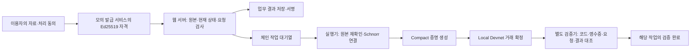

# 블록체인 적용 범위 — 2026-09-27

BizProof는 **합성 기업 자격을 재사용하는 업무 시제품**이다. 웹 검증과 Midnight 검증을 구분한다. 현재 체인은 사설 Midnight Local Devnet(`undeployed`)이며 공개 테스트넷·메인넷이 아니다. 실발급기관, 실제 본인확인 공급자, 공식 기관 접수 API는 연결하지 않았다.

## 실행 경로

공개 자동 모드도 명시적인 최초 동의가 필요하다. 그 뒤 합성 자료의 모의 검토와 실행 허용은 자동으로 처리한다. **대기열 등록, 애니메이션 완료, 서버의 Ed25519 결과 서명은 체인 확정이 아니다.** 작업별 영수증과 검증기 결과가 일치해야 체인 검증 완료로 표시한다. `/verification`은 저장된 과거 사례이며 방문자의 새 작업이나 현재 가동 상태를 증명하지 않는다.

## 사례별 검증

| 경로 | 회로·체인 대조 범위 | 범위 밖 |
|---|---|---|
| 별도 모의 발급 → 가상 구매사·지원기관 두 신청 | 해당 정책의 매출 하한·상한, 업력·지역 등 조건, 자격·보유자·수신자·nonce·요청 연결 | 실제 기업 원본의 진실성, 최종 계약·선정 |
| 서울창업허브 성수·공덕 참고 사례 | 기준일에 따른 일반 업력 또는 서명 근거가 있는 신산업 업력 경로 | 실기관의 신산업 인정, 수혜 이력·납세·서류 내용·입주 심사 |
| 서울 AI 허브 참고 사례 | 해당 연도 매출 **또는** 투자, 최소 상주 인원의 서명된 수치 조건 | 실제 투자 인정·실근무·AI 적합성·선정; 종료 회차 재현 |
| 현대제철·POSCO·SK하이닉스 참고 사례 | 서명된 기업 자격 묶음과 보유자·수신 대상·제출 요청의 연결 | 기술 시험·품목별 신용·ESG·구매 심사·협력사 등록 |

신규 사례의 `eligible=true`는 해당 회로가 다루는 부분 조건의 결과다. `fullEligibility=false`, `officialReceipt=null`은 유지한다. 프로필 해시는 이 서비스가 사용한 규칙 버전을 고정한다. 공고 원문 `sourceDigest`가 없는 참고 규칙을 공식 원문 진위 인증으로 설명하지 않는다. 현재 진행 중인 모집이라는 뜻도 아니다.

## 신뢰와 개인정보

- **Ed25519 → Schnorr 연결:** 웹과 실행기가 원본 Ed25519 서명, 기업·자격 연결, 현재 상태와 요청을 검사한다. 실행기가 만든 Schnorr 자격을 Compact 회로가 검증한다. 원본 Ed25519 서명이나 PDF의 사실성을 회로가 직접 증명하지 않는다.
- **원본 처리:** 웹 서버·모의 발급 서비스·실행기·proof server는 원본 속성을 처리한다. 플랫폼 운영자에게까지 원본이 숨겨지는 시스템이 아니다.
- **체인 공개 정보:** 원본 매출 수치·PDF는 공개 상태에 넣지 않지만, 정책·판정·가명 보유자·요청·취소 식별값은 공개된다. 연결 가능하며 조건 결과로 원본 값의 범위를 추론할 수 있다.
- **별도 검증기:** 실행 지갑 없이 인덱서·계약 코드·영수증·요청을 대조하는 별도 프로세스다. 동일 운영자가 관리하므로 외부 인증기관의 인증이나 운영자로부터의 신뢰 독립성을 뜻하지 않는다.
- **시간과 취소:** 계약의 시간 조건은 관리자가 갱신하는 기준 시각에 의존한다. 모의 발급 원장 취소와 체인 취소는 순차 반영된다. 과거 충족 기록은 당시의 결과이며 현재 유효성은 다시 확인한다. 삭제·취소는 이미 기록된 거래를 지우지 않는다.

공식 GLEIF 인증, SAP 구매망 연결, 실제 기관의 접수·선정, 실명·대표권·문서 전자서명은 현재 구현 범위에 포함되지 않는다. 관련 어댑터와 준비 코드는 실제 공급자 연결 완료의 증거가 아니다.

## 검증 자료

- [자동 시연의 별도 5건·8건 기록](../public/evidence/automatic-demo-2026-09-26.json): 2026-09-26 KST의 두 작업. 관리자 클릭 없이 처리한 합성 사례다. 서로 다른 계약의 거래 수를 한 사례로 합산하지 않는다.
- [이전 취소 포함 9건](evidence/issued-job-public-local-devnet-2026-09-25.json), [이전 비교 조건·취소 포함 11건](../public/evidence/midnight-web-devnet.json): 각각 별도 실행이다.
- 공개 JSON은 허용한 거래·검증 필드만 담은 기록이다. 실시간 재검증과 공개키를 포함한 독립 검증 재현은 [심사자 안내](hackathon-runbook.md)를 따른다.
