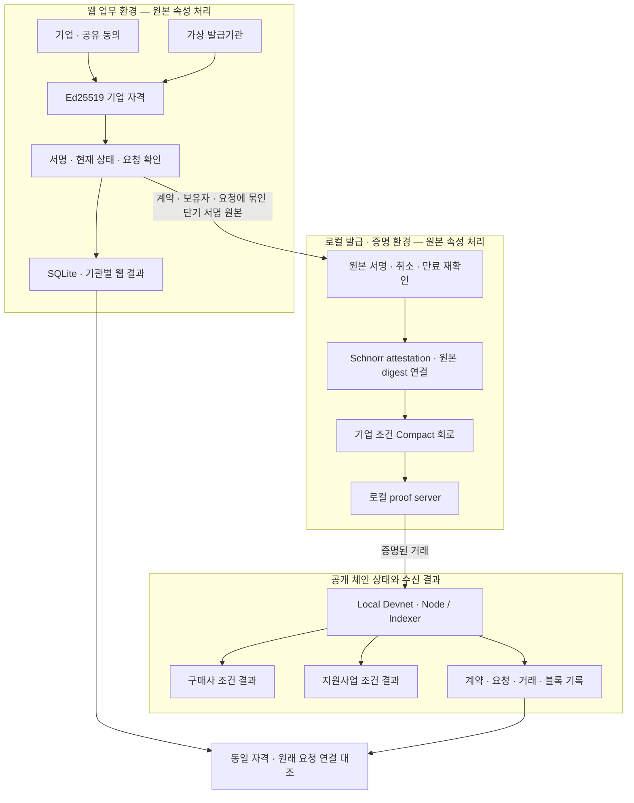

# BizProof의 정보 흐름과 신뢰 경계

## 두 검증 경로

일반 공개 신청은 서버의 Ed25519 검증 경로다. 별도 Local Devnet 실행기는 웹 DB에서 발급된 원본 자격과 원래 요청을 가져와 Midnight에서 다시 증명하고 결과를 대조한다. 일반 방문자의 제출을 자동으로 온체인 완료 처리하지 않는다.

| 주체 | 볼 수 있는 정보 | 신뢰·한계 |
|---|---|---|
| 기업 | 자신의 원본 속성, 자격, 제출 대상 | 공개 체험은 합성 기업이며 개인 신원 확인이 아니다. |
| 웹 발급기관·플랫폼 서버 | 기업 속성, 원본 Ed25519 자격 | 서버가 원본을 처리한다. ZK로 서버에까지 원본을 숨기는 구현은 아니다. |
| 로컬 실행기·proof server | 서명 원본, Schnorr 자격, private witness | 원본 서명을 검증하고 새 attestation에 연결하는 신뢰 주체다. 서버를 외부에 노출하지 않는다. |
| 블록체인 | 발급자 키, 정책, 요청·보유자 식별값, 취소 식별값, 판정 | 민감한 원본 속성은 공개 결과에 넣지 않는다. 정책과 식별값은 공개되며 연결 가능하다. |
| 구매사·지원기관 | 필요한 조건 충족 여부, 자격·요청 연결과 검증 근거 | 조건 판정에서 원본 값의 일부 범위를 추론할 수 있다. |
| 공개 검증 증거 방문자 | 별도 합성 시연의 공개 거래와 결과 | 자신의 신청 결과나 현재 체인의 가동을 증명하는 파일이 아니다. |

## 왜 Midnight을 사용하는가

일반 웹 경로에서 기관은 BizProof 서버의 판정과 서명을 신뢰한다. Midnight 경로에서는 조건 판정 회로와 발급자 서명을 검증하는 증명을 체인에서 확인할 수 있다. 같은 자격의 구매사 매출 하한과 지원사업 매출 상한·업력·지역 조건을 별도 요청으로 묶는다.

ZK는 원본 서류의 진실성을 자동 보장하지 않는다. 발급기관의 실제 검토와 신뢰할 공개키가 필요하다. 데모에서는 가상 발급기관과 합성 데이터를 사용한다. 공개 키를 단기 원본 자체에서 무조건 받아들이지 않고, 인증된 웹의 발급기관 상태에서 먼저 확보한다.

## 만료·취소·실패

- 단기 웹 원본은 최대 10분 유효하며 실행 단계마다 인증된 웹 API에서 현재 상태를 다시 검사한다.
- 웹 원본에서 새 Schnorr 자격으로 전환하므로 이 발급·연결 경로 자체가 신뢰 경계이다.
- 체인 attestation 취소와 웹 원본 취소는 별도이다. 과거 충족 기록은 당시 결과로 표시한다.
- 취소 후 시연은 취소 거래 확정 이후 SDK의 회로 assertion에서 차단된다. 실패한 제출의 성공 거래를 만들어 표시하지 않는다.
- 시간 검사는 계약 관리자가 갱신하는 기준 시각에 의존한다. 외부 시각 오라클을 구현한 것이 아니다.
- public holder / revocation 식별값은 연결 가능하다. 완전 익명성·기관 간 추적 불가능성을 보장하지 않는다.

## 기록 공개 원칙

`public/evidence/midnight-web-devnet.json`에는 허용된 필드만 배포한다. 원본 claims, 비밀키, 세션 쿠키, 개인 저장소, 암호화 비밀번호, witness, 실제 방문자 데이터는 배포하지 않는다. `artifacts`의 생성 준비 메타데이터와 실제 거래 영수증의 성공 여부를 혼동하지 않는다.

전체 방문자 분석은 업무 자격 검증과 별도 시스템이다. 방문 분석 데이터와 관리자 계정은 제출·검증 증거에 포함하지 않는다.
